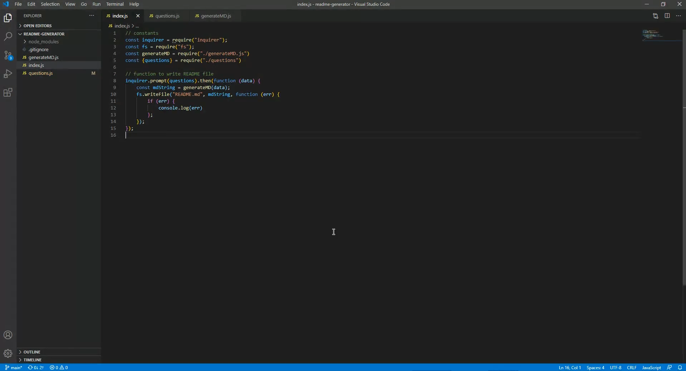

#README Generator!

## Description
Creates a professional README.md that saves the programmer time in which they can spend on coding.
        
## Table of Contents
- [Installation](#installation)

- [Usage](#usage)

- [Video](#video)

- [License](#license)

- [Test](#test)

- [Contributors](#contributors)

- [Questions](#questions)

    
## Installation
Visual Studio Code must be installed on computer. Through Visual Studio Code, npm install inquire must be installed to run the application.

## Usage
Git clone the repository into a folder on your computer and open it through Visual Studio Code. In Visual Studio Code, right click on index.js and "Open in Integrated Terminal", Import node module by typing npm init, wait for installation. Then install inquirer by typing npm install inquirer, wait for installation. Once both installation are finished type node index.js then answer following prompts!

## Video

## License
This project uses MIT

## Test
None

## Contributors
Jae Kim

## Questions
View my other projects!

https://github.com/JSK321

Have any questions?

Email me at: N/A